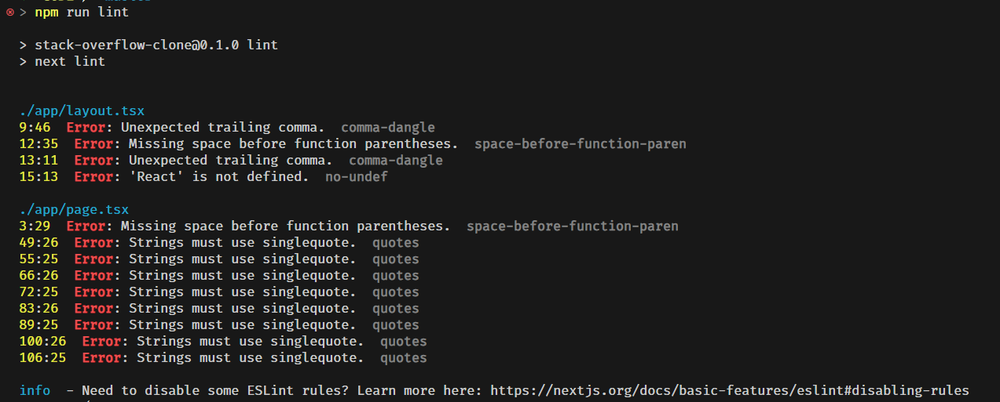

# NEXT JS STUDY DOCS

- [NEXT JS STUDY DOCS](#next-js-study-docs)
  - [Setup 🔲](#setup-)
    - [DevFlow Project Setup ✅](#devflow-project-setup-)
    - [Eslint Prettier Setup 🔲](#eslint-prettier-setup-)
      - [Install Prettier](#install-prettier)
      - [Setting things up for VSCode ✅](#setting-things-up-for-vscode-)
    - [Git-Github Setup 🔲](#git-github-setup-)
    - [Tailwind CSS Setup 🔲](#tailwind-css-setup-)
    - [Code Architecture 🔲](#code-architecture-)
    - [](#)
    - [](#-1)
    - [](#-2)
    - [](#-3)
    - [](#-4)
    - [](#-5)
    - [](#-6)


## Setup 🔲

### DevFlow Project Setup ✅

next js installation page https://nextjs.org/docs/getting-started/installation

let's create a new project with the following command:

```bash
npx create-next-app@latest
```


our app default folder structure


let's run the app

```bash
npm run dev
```

### Eslint Prettier Setup 🔲


let's install eslint standard

```bash
npm install eslint-config-standard
```
](image-3.png)

let's update the eslint config file

```json
{
	"extends": ["next/core-web-vitals", "standard"]
}

```


let's run the lint

```bash
npm run lint
```
result



Adding an ESLint Configuration for TailwindCSS

let's install eslint plugin tailwind

```bash
npm install eslint-plugin-tailwindcss
```

Having our class names organized logically in Tailwind makes the code easier to read and review. We can install another ESLint config that takes care of that to do this automatically.

Prettier VS ESLint potential conflicts

ESLint sometimes likes to enter into conflict with Prettier. 🥊

To avoid these situations, you should run:

```bash
npm install eslint-config-prettier
```
#### Install Prettier

Don’t forget to install prettier before proceeding; otherwise, things will not work, and you won’t know why. 🤷

```bash
npm install prettier
```
#### Setting things up for VSCode ✅

Now that everything is set up command-line-wise, it’s time to integrate ESLint and Prettier with VSCode. For that, we will need to modify the `**settings.json**` file or create a config specific to our project that you can share with others if you’d like. We’ll go with the latter.

In your Next.js project at the root, create a `**.vscode`** folder and within it a `**settings.json**` file with the following code:

```json
{
  "editor.defaultFormatter": "esbenp.prettier-vscode",
  "editor.formatOnSave": true,
  "editor.codeActionsOnSave": {
    "source.fixAll.eslint": true,
    "source.addMissingImports": true
  },
  "[typescriptreact]": {
    "editor.defaultFormatter": "esbenp.prettier-vscode"
  }
}
```

final result
```json
{
	"extends": [
		"next/core-web-vitals",
		"standard",
		"plugin:tailwindcss/recommended",
		"prettier"
	]
}

```
### Git-Github Setup 🔲
### Tailwind CSS Setup 🔲
### Code Architecture 🔲


### 
### 
### 
### 
### 
### 
### 