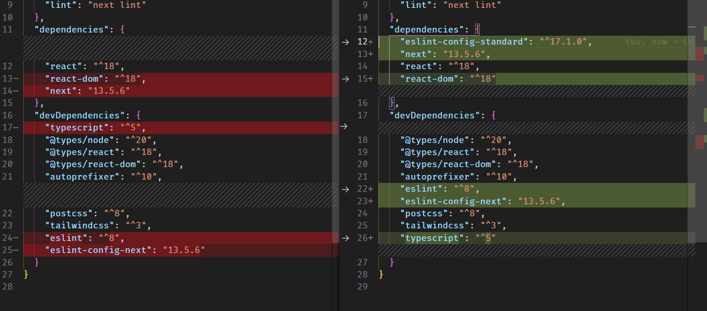
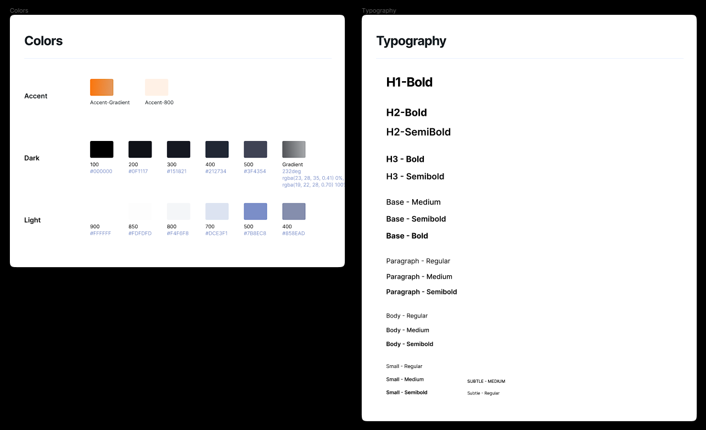
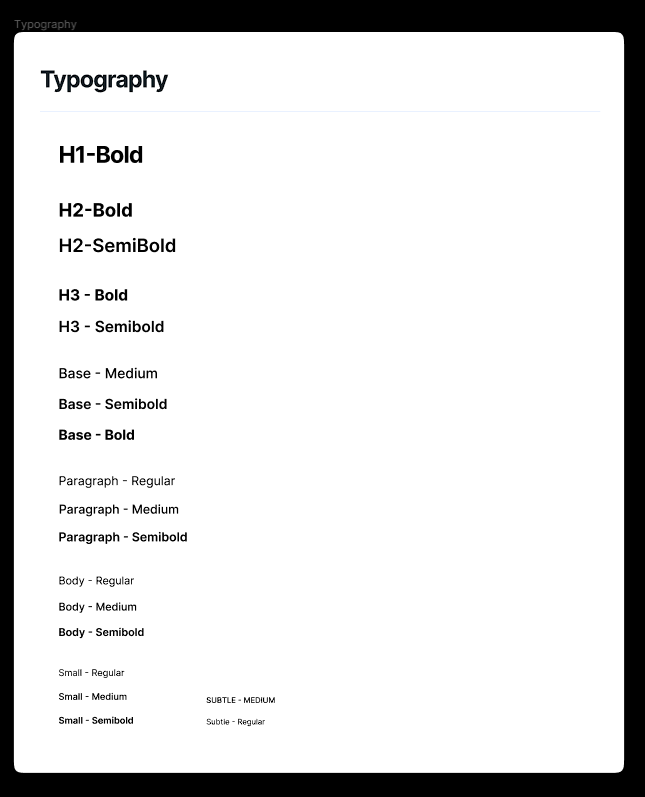

# NEXT JS STUDY DOCS

- [NEXT JS STUDY DOCS](#next-js-study-docs)
  - [Setup ✅](#setup-)
    - [DevFlow Project Setup ✅](#devflow-project-setup-)
    - [Eslint Prettier Setup 🔲](#eslint-prettier-setup-)
      - [Install Prettier](#install-prettier)
      - [Setting things up for VSCode ✅](#setting-things-up-for-vscode-)
    - [Git-Github Setup ✅](#git-github-setup-)
    - [Tailwind CSS Setup ✅](#tailwind-css-setup-)
    - [Code Architecture ✅](#code-architecture-)
    - [](#)
    - [](#-1)
    - [](#-2)
    - [](#-3)
    - [](#-4)
    - [](#-5)
    - [](#-6)


## Setup ✅

### DevFlow Project Setup ✅

next js installation page https://nextjs.org/docs/getting-started/installation

let's create a new project with the following command:

```bash
npx create-next-app@latest
```


our app default folder structure


let's run the app

```bash
npm run dev
```

### Eslint Prettier Setup 🔲


let's install eslint standard

```bash
npm install eslint-config-standard
```
](image-3.png)

let's update the eslint config file

```json
{
	"extends": ["next/core-web-vitals", "standard"]
}

```


let's run the lint

```bash
npm run lint
```
result


Adding an ESLint Configuration for TailwindCSS

let's install eslint plugin tailwind

```bash
npm install eslint-plugin-tailwindcss
```

Having our class names organized logically in Tailwind makes the code easier to read and review. We can install another ESLint config that takes care of that to do this automatically.

Prettier VS ESLint potential conflicts

ESLint sometimes likes to enter into conflict with Prettier. 🥊

To avoid these situations, you should run:

```bash
npm install eslint-config-prettier
```
#### Install Prettier

Don’t forget to install prettier before proceeding; otherwise, things will not work, and you won’t know why. 🤷

```bash
npm install prettier
```
#### Setting things up for VSCode ✅

Now that everything is set up command-line-wise, it’s time to integrate ESLint and Prettier with VSCode. For that, we will need to modify the `**settings.json**` file or create a config specific to our project that you can share with others if you’d like. We’ll go with the latter.

In your Next.js project at the root, create a `**.vscode`** folder and within it a `**settings.json**` file with the following code:

```json
{
  "editor.defaultFormatter": "esbenp.prettier-vscode",
  "editor.formatOnSave": true,
  "editor.codeActionsOnSave": {
    "source.fixAll.eslint": true,
    "source.addMissingImports": true
  },
  "[typescriptreact]": {
    "editor.defaultFormatter": "esbenp.prettier-vscode"
  }
}
```

final result
```json
{
	"extends": [
		"next/core-web-vitals",
		"standard",
		"plugin:tailwindcss/recommended",
		"prettier"
	]
}

```
### Git-Github Setup ✅
create a new repo on github


### Tailwind CSS Setup ✅
style guide for the app
colors

typography


let's add the design system to our application
```ts
import type { Config } from 'tailwindcss';

const config: Config = {
	content: [
		'./pages/**/*.{js,ts,jsx,tsx,mdx}',
		'./components/**/*.{js,ts,jsx,tsx,mdx}',
		'./app/**/*.{js,ts,jsx,tsx,mdx}'
	],
	theme: {
		extend: {
			colors: {
				primary: {
					500: '#FF7000',
					100: '#FFF1E6'
				},
				dark: {
					100: '#00000',
					200: '#0F1117',
					300: '#151821',
					400: '#212734',
					500: '#3F4354'
				},
				light: {
					900: '#FFFFFF',
					800: '#F4F6F8',
					850: '#FDFDFD',
					700: '#DCE3F1',
					500: '#7B8EC8',
					400: '#858EAD'
				},
				'accent-blue': '#1DA1F2'
			},
			fontFamily: {
				inter: ['var(--font-inter)'],
				spaceGrotesk: ['var(--font-spaceGrotesk)']
			},
			boxShadow: {
				'light-100':
					'0px 12px 20px 0px rgba(184, 184, 184, 0.03), 0px 6px 12px 0px',
				'light-200': '10px 10px 20px 0px rgba(218, 213, 213, 0.10)',
				'light-300': '-10px 10px 20px 0px rgba(218, 213, 213, 0.10)',
				'dark-100': '0px 2px 10px 0px rgba(46, 52, 56, 0.10)',
				'dark-200': '2px 0px 20px 0px rgba(39, 36, 36, 0.04)'
			},
			backgroundImage: {
				'auth-dark': "url('/assets/images/auth-dark.png')",
				'auth-light': "url('/assets/images/auth-light.png')"
			},
			screens: {
				xs: '420px'
			},
			keyframes: {
				'accordion-down': {
					from: { height: '0' },
					to: { height: 'var(--radix-accordion-content-height)' }
				},
				'accordion-up': {
					from: { height: 'var(--radix-accordion-content-height)' },
					to: { height: '0' }
				}
			},
			animation: {
				'accordion-down': 'accordion-down 0.2s ease-out',
				'accordion-up': 'accordion-up 0.2s ease-out'
			}
		}
	},
	plugins: [require('tailwindcss-animate'), require('@tailwindcss/typography')]
};
export default config;

```

and create a folder called styles and file inside a theme.css

```css
@tailwind base;
@tailwind components;
@tailwind utilities;

@layer utilities {
	.background-light850_dark100 {
		@apply bg-light-850 dark:bg-dark-100;
	}
	.background-light900_dark200 {
		@apply bg-light-900 dark:bg-dark-200;
	}
	.background-light900_dark300 {
		@apply bg-light-900 dark:bg-dark-300;
	}
	.background-light800_darkgradient {
		@apply bg-light-800 dark:dark-gradient;
	}
	.background-light800_dark400 {
		@apply bg-light-800 dark:bg-dark-400 !important;
	}
	.background-light700_dark400 {
		@apply bg-light-700 dark:bg-dark-400;
	}
	.background-light700_dark300 {
		@apply bg-light-700 dark:bg-dark-300;
	}
	.background-light800_dark400 {
		@apply bg-light-800 dark:bg-dark-400;
	}
	.background-light800_dark300 {
		@apply bg-light-800 dark:bg-dark-300 !important;
	}
	.text-dark100_light900 {
		@apply text-dark-100 dark:text-light-900 !important;
	}
	.text-dark200_light900 {
		@apply text-dark-200 dark:text-light-900;
	}
	.text-dark200_light800 {
		@apply text-dark-200 dark:text-light-800 !important;
	}
	.text-dark300_light700 {
		@apply text-dark-300 dark:text-light-700;
	}
	.text-dark400_light700 {
		@apply text-dark-400 dark:text-light-700;
	}
	.text-dark500_light700 {
		@apply text-dark-500 dark:text-light-700 !important;
	}
	.text-dark500_light500 {
		@apply text-dark-500 dark:text-light-500;
	}
	.text-dark300_light900 {
		@apply text-dark-300 dark:text-light-900 !important;
	}
	.text-dark400_light800 {
		@apply text-dark-400 dark:text-light-800;
	}
	.text-light400_light500 {
		@apply text-light-400 dark:text-light-500 !important;
	}
	.text-dark400_light500 {
		@apply text-dark-400 dark:text-light-500;
	}
	.text-dark400_light900 {
		@apply text-dark-400 dark:text-light-900 !important;
	}
	.text-light400_light500 {
		@apply text-light-400 dark:text-light-500 !important;
	}
	.light-border {
		@apply border-light-800 dark:border-dark-300;
	}
	.light-border-2 {
		@apply border-light-700 dark:border-dark-400 !important;
	}
	.h1-bold {
		@apply text-[30px] font-bold leading-[42px] tracking-tighter;
	}
	.h2-bold {
		@apply text-[24px] font-bold leading-[31.2px];
	}
	.h2-semibold {
		@apply text-[24px] font-semibold leading-[31.2px];
	}
	.h3-bold {
		@apply text-[20px] font-bold leading-[26px];
	}
	.h3-semibold {
		@apply text-[20px] font-semibold leading-[24.8px];
	}
	.base-medium {
		@apply text-[18px] font-medium leading-[25.2px];
	}
	.base-semibold {
		@apply text-[18px] font-semibold leading-[25.2px];
	}
	.base-bold {
		@apply text-[18px] font-bold leading-[140%];
	}
	.paragraph-regular {
		@apply text-[16px] font-normal leading-[22.4px];
	}
	.paragraph-medium {
		@apply text-[16px] font-medium leading-[22.4px];
	}
	.paragraph-semibold {
		@apply text-[16px] font-semibold leading-[20.8px];
	}
	.body-regular {
		@apply text-[14px] font-normal leading-[19.6px];
	}
	.body-medium {
		@apply text-[14px] font-medium leading-[18.2px];
	}
	.body-semibold {
		@apply text-[14px] font-semibold leading-[18.2px];
	}
	.small-regular {
		@apply text-[12px] font-normal leading-[15.6px];
	}
	.small-medium {
		@apply text-[12px] font-medium leading-[15.6px];
	}
	.small-semibold {
		@apply text-[12px] font-semibold leading-[15.6px];
	}
	.subtle-medium {
		@apply text-[10px] font-medium leading-[13px] !important;
	}
	.subtle-regular {
		@apply text-[10px] font-normal leading-[13px];
	}
	.placeholder {
		@apply placeholder:text-light-400 dark:placeholder:text-light-;
	}
	.invert-colors {
		@apply invert dark:invert-0;
	}
	.shadow-light100_dark100 {
		@apply shadow-light-100 dark:shadow-dark-100;
	}
	.shadow-light100_darknone {
		@apply shadow-light-100 dark:shadow-none;
	}
	.primary-gradient {
		background: linear-gradient(129deg, #ff7000 0%, #e2995f 100%);
	}
	.dark-gradient {
		background: linear-gradient(
			232deg,
			rgba(23, 28, 35, 0.41) 0%,
			rgba(19, 22, 28, 0.7) 100%
		);
	}
}
```
and change the globals.css
```css
@tailwind base;
@tailwind components;
@tailwind utilities;
@import url('../styles/theme.css');
body {
	font-family: 'Inter', sans-serif;
}
@layer utilities {
	.flex-center {
		@apply flex justify-center items-center;
	}
	.flex-between {
		@apply flex justify-between items-center;
	}
	.flex-start {
		@apply flex justify-start items-center;
	}
	.card-wrapper {
		@apply bg-light-900 dark:dark-gradient shadow-light-100 dar;
	}
	.btn {
		@apply bg-light-800 dark:bg-dark-300 !important;
	}
	.btn-secondary {
		@apply bg-light-800 dark:bg-dark-400 !important;
	}
	.btn-tertiary {
		@apply bg-light-700 dark:bg-dark-300 !important;
	}
	.markdown {
		@apply max-w-full prose dark:prose-p:text-light-700 dark:pros;
	}
	.primary-gradient {
		background: linear-gradient(129deg, #ff7000 0%, #e2995f 100%);
	}
	.dark-gradient {
		background: linear-gradient(
			232deg,
			rgba(23, 28, 35, 0.41) 0%,
			rgba(19, 22, 28, 0.7) 100%
		);
	}
	.tab {
		@apply min-h-full dark:bg-dark-400 bg-light-800 text-light-5;
	}
	.no-focus {
		@apply focus-visible:ring-0 focus-visible:ring-transparent focus;
	}
}

.active-theme {
	filter: invert(53%) sepia(98%) saturate(3332%) hue-rotate(0deg)
		brightness(104%) contrast(106%) !important;
}
.light-gradient {
	background: linear-gradient(
		132deg,
		rgba(247, 249, 255, 0.5) 0%,
		rgba(229, 237, 255, 0.25) 100%
	);
}
.primary-text-gradient {
	background: linear-gradient(129deg, #ff7000 0%, #e2995f 100%);
	background-clip: text;
	-webkit-background-clip: text;
	-webkit-text-fill-color: transparent;
}
.custom-scrollbar::-webkit-scrollbar {
	width: 3px;
	height: 3px;
	border-radius: 2px;
}
.custom-scrollbar::-webkit-scrollbar-track {
	background: #ffffff;
}
.custom-scrollbar::-webkit-scrollbar-thumb {
	background: #888;
	border-radius: 50px;
}
.custom-scrollbar::-webkit-scrollbar-thumb:hover {
	background: #555;
}
/* Markdown Start */
.markdown a {
	color: #1da1f2;
}
.markdown a,
code {
	/* These are technically the same, but use both */
	overflow-wrap: break-word;
	word-wrap: break-word;
	-ms-word-break: break-all;
	/* This is the dangerous one in WebKit, as it breaks things whereve
word-break: break-all;
/* Instead use this non-standard one: */
	word-break: break-word;
	/* Adds a hyphen where the word breaks, if supported (No Blink) */
	-ms-hyphens: auto;
	-moz-hyphens: auto;
	-webkit-hyphens: auto;
	hyphens: auto;
	padding: 2px;
	color: #ff7000 !important;
}
.markdown pre {
	display: grid;
	width: 100%;
}
.markdown pre code {
	width: 100%;
	display: block;
	overflow-x: auto;
	color: inherit !important;
}
/* Markdown End */

/* Clerk */
.cl-internal-b3fm6y {
	background: linear-gradient(129deg, #ff7000 0%, #e2995f 100%);
}
.hash-span {
	margin-top: -140px;
	padding-bottom: 140px;
	display: block;
}
/* Hide scrollbar for Chrome, Safari and Opera */
.no-scrollbar::-webkit-scrollbar {
	display: none;
}
/* Hide scrollbar for IE, Edge and Firefox */
.no-scrollbar {
	-ms-overflow-style: none; /* IE and Edge */
	scrollbar-width: none; /* Firefox */
}

```


and install the following packages


bash command
```bash
npm i -D tailwindcss-animate @tailwindcss/typography
```

cleanup the main page

```tsx
export default function Home() {
	return (
		<main>
			<h1 className="h1-bold ">NEXT JS !# here we come</h1>
		</main>
	);
}

```

output 


### Code Architecture ✅


### 
### 
### 
### 
### 
### 
### 